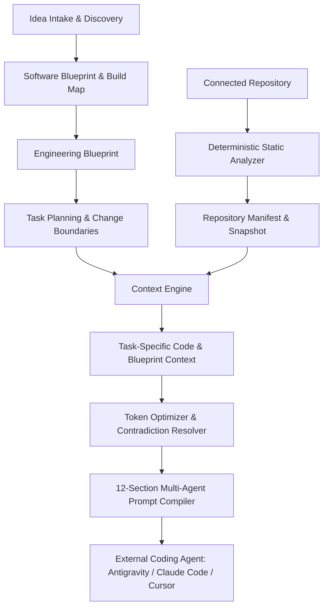

# Aigenstra: Project Architecture & System Design

> Reference Document: Post-Phase 6 Architecture (Product Intelligence + Implementation Intelligence)

## 1. System Layers

1. **Product Intelligence Layer**:
   - `lib/ai/product-understanding.ts`: Extracts actors, workflows, and uncertainties.
   - `lib/ai/blueprint-engine.ts`: Generates 13-section progressive disclosure Software Blueprint.
   - `lib/ai/build-map-engine.ts`: Chronological stages with deliverables and agent guidance.

2. **Engineering Intelligence Layer**:
   - `lib/ai/engineering-intelligence.ts`: 15-domain specifications, API contracts, entity relations, and state machines.
   - `lib/ai/engineering-readiness.ts`: Tradeoffs, alternatives, and decision controls.

3. **Task Planning & Context Engine**:
   - `lib/ai/task-engine.ts`: Right-sized tasks with explicit `mustChange`, `mayChange`, `mustNotChange` boundaries.
   - `lib/ai/context-engine.ts`: Curates minimal sufficient context slices with explainable exclusions.

4. **Project Connection & Repository Intelligence (Phase 6)**:
   - `lib/repository/inventory.ts`: Classifies files by path, extension, and importance.
   - `lib/repository/ignore-rules.ts`: Excludes dependencies (`node_modules`), caches (`.next`), and binaries.
   - `lib/repository/secrets.ts`: In-memory redaction of secrets (`.env*`, API keys, JWTs, private keys).
   - `lib/repository/detectors.ts`: Deterministic detection of frameworks, languages, databases, auth, and UI libraries.
   - `lib/repository/routes.ts`: Maps Next.js App Router routes, APIs, layouts, and middleware.
   - `lib/repository/symbols.ts`: Extracts functions, React components, hooks, routes, schemas, and structural code chunks.
   - `lib/repository/drift.ts`: Planned vs. Actual difference detection, duplicate system warnings, feature-to-code mapping.
   - `lib/repository/retrieval.ts`: Task-aware layered retrieval of relevant files and chunks.
   - `lib/repository/change-detection.ts`: Incremental hash diffing across snapshot versions.
   - `lib/repository/pipeline.ts`: Zero-token deterministic static analysis pipeline.
   - `lib/repository/store.ts`: Database persistence with JSONB fallback storage.

5. **Prompt Compiler & Agent Adapters**:
   - `lib/ai/prompt-compiler.ts`: 12-section architecture with specialized profiles (Google Antigravity, Claude Code, Cursor, Codex).
   - Injects actual repository stack into `PROJECT_CONTEXT` and existing capabilities into `CURRENT_STATE` to instruct external agents to extend rather than rebuild existing systems.
