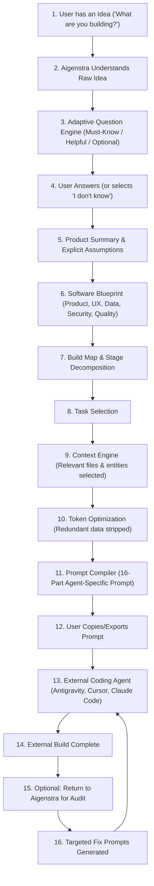

# AIGENSTRA — USER FLOW

## Primary User Journey (Idea to Code Prompt to Audit)

## Step-by-Step Stage Breakdown

### Stage 1: Idea Intake
- **User Action:** Enters raw, messy concept into a single focused input box.
- **System Action:** Identifies project archetype (SaaS, Marketplace, Web App, Tool, etc.) and establishes project workspace without premature conclusions.

### Stage 2: Adaptive Discovery & Clarification
- **User Action:** Answers minimal prioritized questions. Can click "I don't know" to accept sensible defaults.
- **System Action:** Identifies missing decisions, records provisional assumptions, and updates the structured Decision Log.

### Stage 3: Product Summary & Software Blueprint
- **User Action:** Reviews what they are building in plain language, with option to inspect expandable technical details.
- **System Action:** Generates comprehensive Blueprint covering journeys, screens, business rules, data schemas, integrations, and security threat vectors.

### Stage 4: Progressive Build Map & Task Breakdown
- **User Action:** Views the structured roadmap of stages and selects the current active task.
- **System Action:** Deconstructs product into manageable, sequential tasks with explicit prerequisites and acceptance criteria.

### Stage 5: Context Engine & Token Optimization
- **User Action:** Clicks "Generate Build Prompt" for the active task.
- **System Action:** Gathers only relevant schemas, routes, rules, and constraints for that task. Prunes unrelated context to minimize tokens and prevent AI confusion.

### Stage 6: Prompt Compilation & Agent Export
- **User Action:** Previews the structured prompt, selects target environment (e.g., Google Antigravity, Cursor, Claude Code), copies or downloads the prompt.
- **System Action:** Formats prompt according to the target agent profile, displays context inclusion rationale, and provides estimated token counts.

### Stage 7: Implementation & Closed-Loop Audit
- **User Action:** Runs prompt in their external AI IDE. Brings generated code/repo back to Aigenstra for verification.
- **System Action:** Audits implementation across security, architecture, UX, and performance; outputs concise, targeted fix prompts for any identified gaps.
